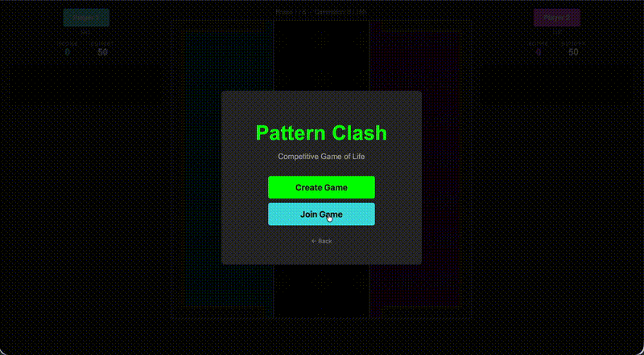

# Pattern Clash

A competitive, browser-based strategy game based on Conway's Game of Life. Two
players buy pattern cards, place them on a shared grid, and try to send cells
across into the opponent's score zone.

🎮 **[Play it live](https://jonnysod.github.io/pattern-clash/)** — works in any modern browser, no install needed.



## How to play

Each round has three phases:

1. **Buy** — Spend your budget on Conway pattern cards (Glider, LWSS, Glider Gun, …). Unspent budget carries over.
2. **Place** — Players alternate placing cards in their own zone. Opponent's cards stay face-down until played.
3. **Simulate** — The board evolves and cells reaching the opponent's score zone earn a point.

Simulation length grows each round, so late rounds reach deeper into the board.
Draws are possible.

## Modes

- **Local** — hotseat on one device
- **vs Bot** — an opponent that reads threats off the board and simulates its options before placing
- **Online** — two browsers via a 4-character lobby code
- **Mini Games** — standalone Conway puzzles with local best scores

## Tech

TypeScript · Canvas 2D · Firebase Realtime Database (online multiplayer) · Vitest

No bundler — native ES modules with an import map. A single `SyncManager` interface drives both local hotseat and online mode from the same UI code.

Built side-by-side with Claude as a development partner.

## Local setup

```bash
git clone https://github.com/jonnysod/pattern-clash.git
cd pattern-clash
npm install
npm run watch   # TypeScript compiler in watch mode
```

Open `index.html` with the **Live Server** extension in VSCode. Run tests with `npm test`.

## Forking & online play

If you fork this repo, online multiplayer defaults to my Firebase project. To use your own:

1. Create a free Firebase project and enable Realtime Database
2. Replace the config in `src/firebase.ts` with your own
3. Deploy `security-rules.json` with `firebase deploy --only database`

Local hotseat works without any of this.

## License

MIT — see [LICENSE](LICENSE).
